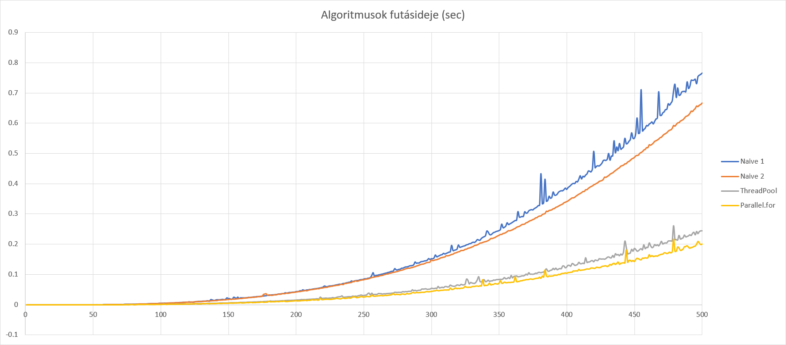
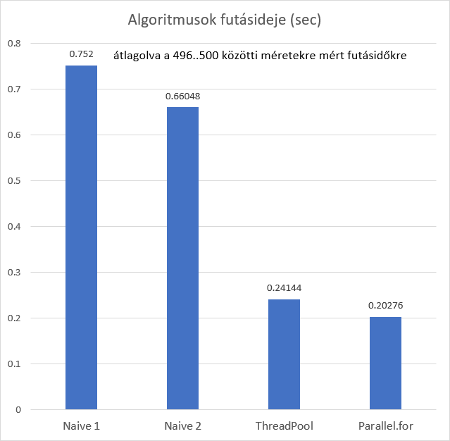
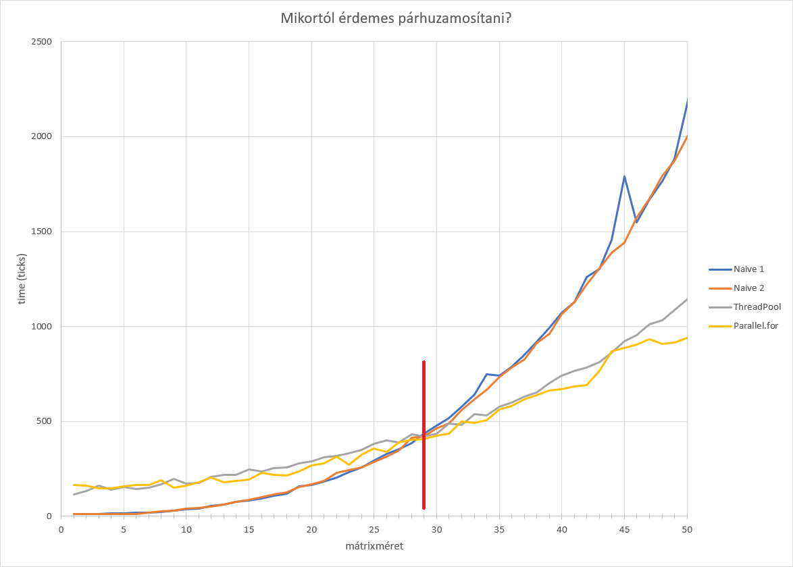

# 1. feladat: mátrix szorzás C# nyelven

Minden mátrixméretre 28-szor mértem le a szorzás idejét, majd a 4 legkisebb és legnagyobb értéket eldobtam.

Megismételtem a mérést az 1ms-es felbontást "tick" felbontásra növelve és így sikerült olyan eredményt kapnom, amiben egy bizonyos mátrixméretig a naiv algoritmusok kicsivel gyorsabbak, mint a párhuzamosak.
A határ láthatóan 29x29-es mátrixméretnél van, így onnantól érdemes párhuzamosítani!

A gépem adatai, amin a mérést végeztem:

- i7-6700HQ
- 4 fizikai mag
- 8 logikai mag
- 8GB RAM
