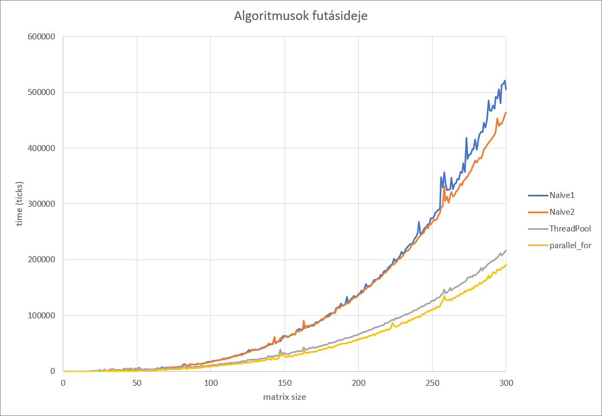
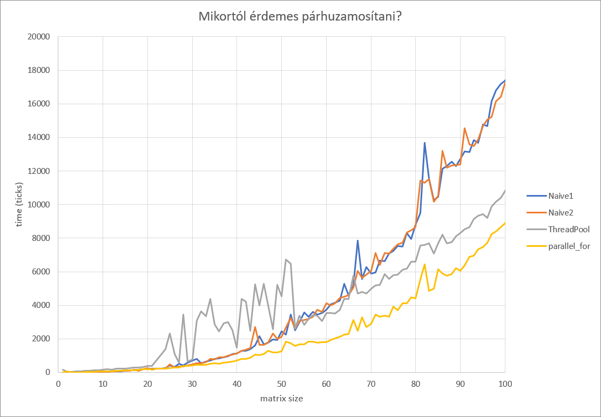
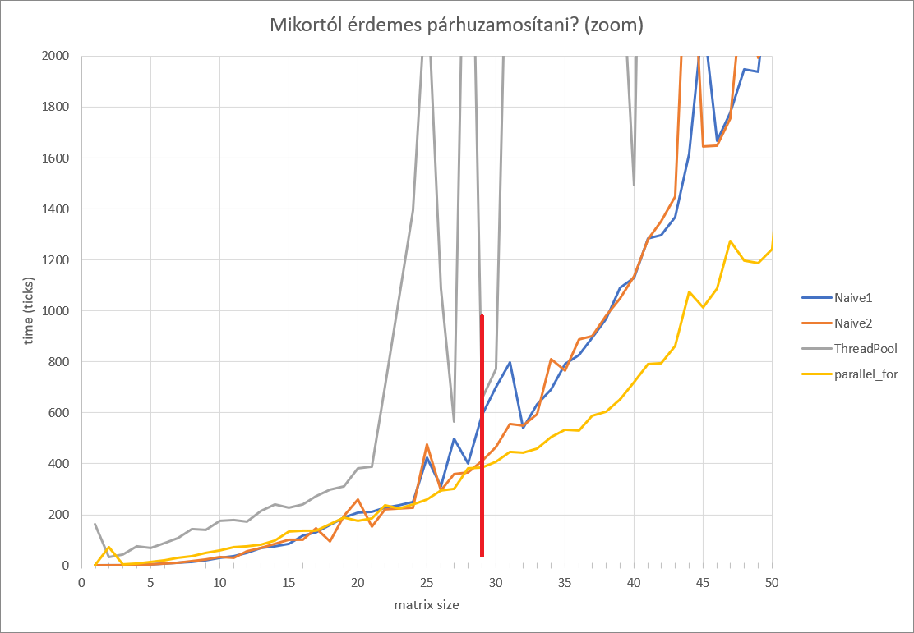
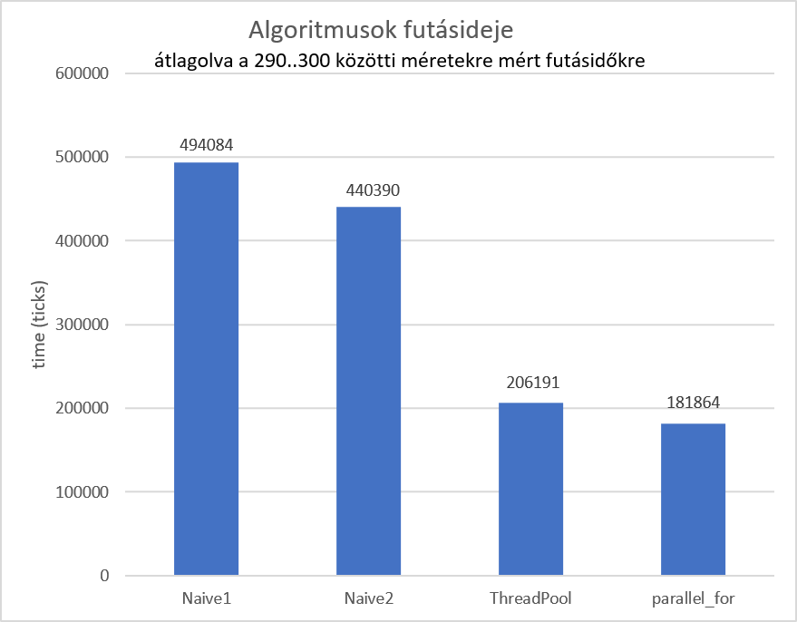

A feladatot c++ nyelven végül a Parallel Patterns Library használatával oldottam meg, nem a Threading Building Blocks-szal.

# 2. feladat: mátrix szorzás választott nyelven

Minden mátrixméretre 28-szor mértem le a szorzás idejét, majd a 6 legkisebb és legnagyobb értéket eldobtam.

A párhuzamosítási határ megint csak 29x29-es mátrixméretre jött ki, mint az C#-os megoldásomban.

A ThreadPool szálainak száma: (logikai CPU magok száma) + 1

A gépem adatai, amin a mérést végeztem:

- i7-6700HQ
- 4 fizikai mag
- 8 logikai mag
- 8GB RAM
