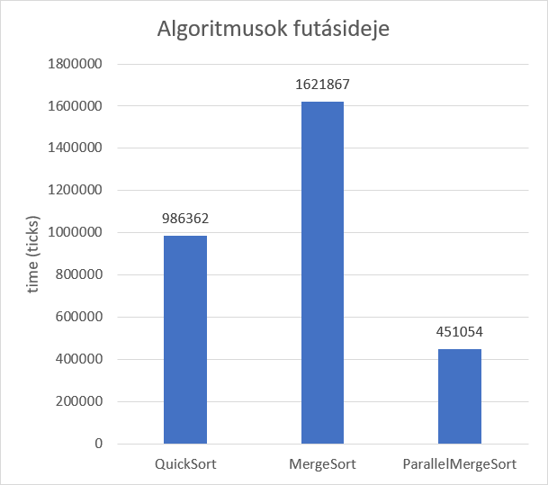
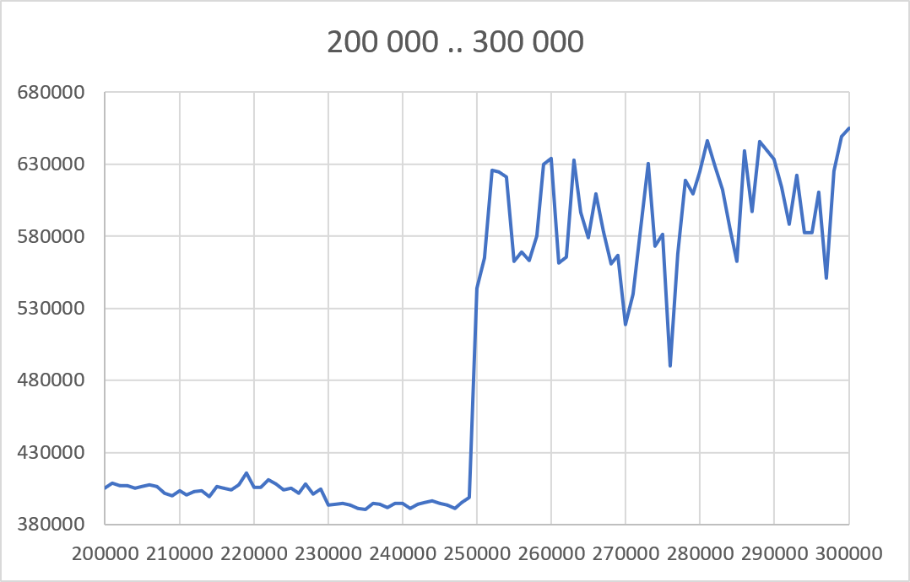
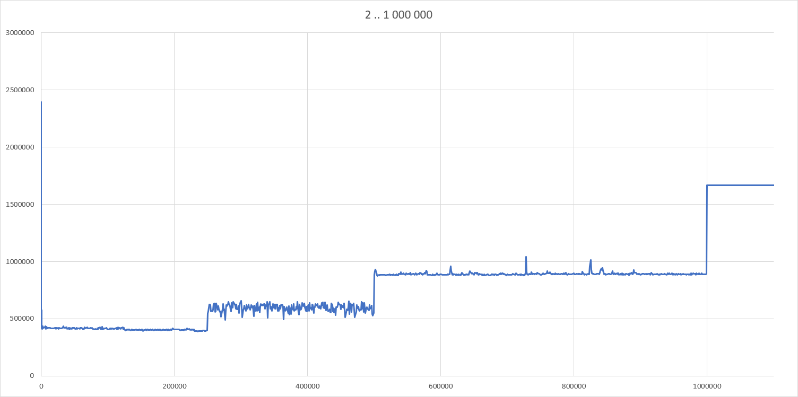
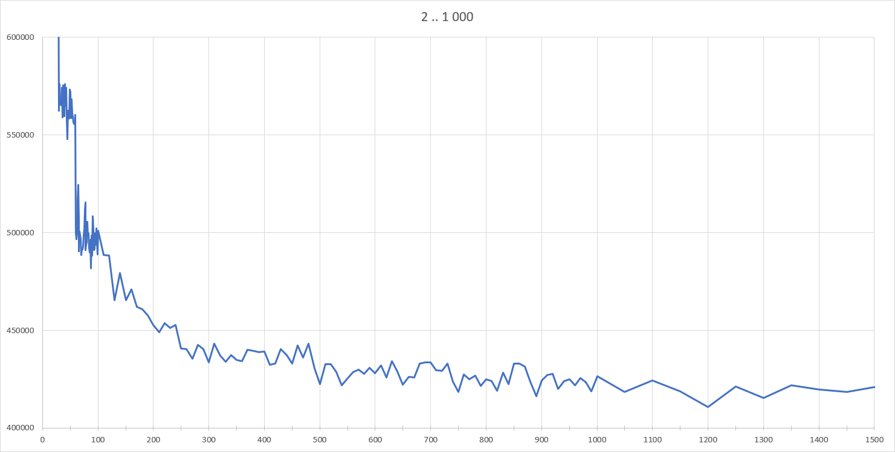

# 3. feladat: tömb rendezés parallel merge sort alrogitmussal C# nyelven

Az összes mérést 1 000 000 elemű listával végeztem.

Az egyszálú és párhuzamos algoritmusok összehasonlítása:

Előzetesen arra számítottam, hogy az optimum 1000 körülre fog kijönni, de a grafikonon a minimum 240000 körül van.
A méréseket természetesen többször végeztem el (20 futtatás, 4 legkisebb és 4 legnagyobb értéket eldobva)

A gépem adatai, amin a mérést végeztem:

- i7-6700HQ
- 4 fizikai mag
- 8 logikai mag
- 8GB RAM
