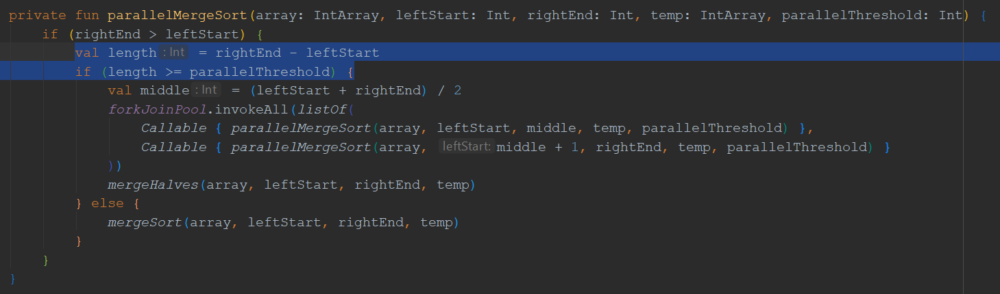
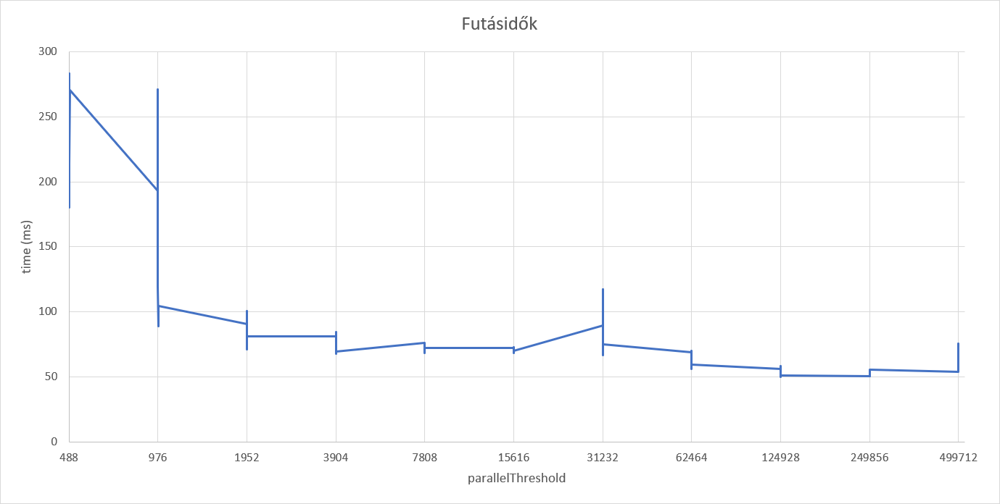

# 4. feladat: tömb rendezés parallel merge sort alrogitmussal választott (Kotlin) nyelven

Az összes mérést 1 000 000 elemű listával végeztem.

Az egyszálú és párhuzamos algoritmusok összehasonlítása:

TODO

Rájöttem, hogy a képen látható length változó csak kevés fajta értéket vehet fel, és ezek az értékek a rendezendő tömb hosszától függenek.
(1, 2, 3, 6, 7, 14, 15, 29, 30, 60, 61, 121, 122, 243, 244, 487, 488, 975, 976, 1952, 1953, 3905, 3906, 7811, 7812, 15624, 31249, 62499, 124999, 249999, 499999)
(Ez amiatt van, mert az algoritmus mindig felezi az intervallumokat.)
Ebből kifolyólag csak az ezen számok kicsi környezetében lévő parallelThreshold értékekre futtattam a benchmarkot, mert pl. egy tetszőleges 1000-es értékre ugyanazt az eredményt kapnám, mint a 976-ra, vagy az 1951-re.
(ezeket a számokat nem hardcode-oltam bele a programba, hanem kiszámoltattam vele.)

A gépem adatai, amin a mérést végeztem:

- i7-6700HQ
- 4 fizikai mag
- 8 logikai mag
- 8GB RAM
