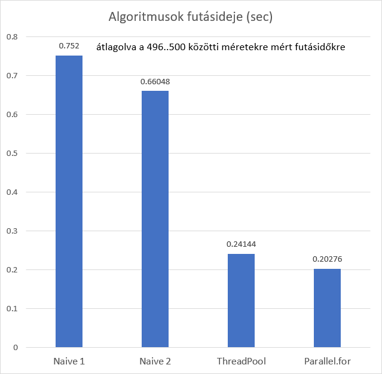

# 1. feladat: mátrix szorzás C# nyelven

A mérési adataim sajnos nem elég pontosak, hogy legyen olyan mátrixméret, aminél a naiv algoritmus gyorsabb, mint bármelyik párhuzamos.
Ha a Stopwatch-nek az ElapsedTicks property-jét használtam volna, akkor valószínűleg meg tudtam volna mérni.

Végső konklúziónak levonhatjuk a mérések alapján, hogy 100x100-as mátrixot már biztosan érdemes párhuzamosan szorozni.

A gépem adatai, amin a mérést végeztem:

i7-6700HQ

 4 fizikai mag
 
 8 logikai mag
 
8GB RAM
